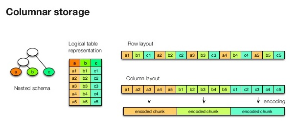
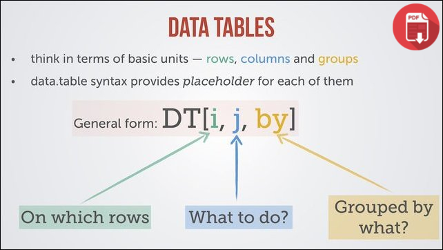
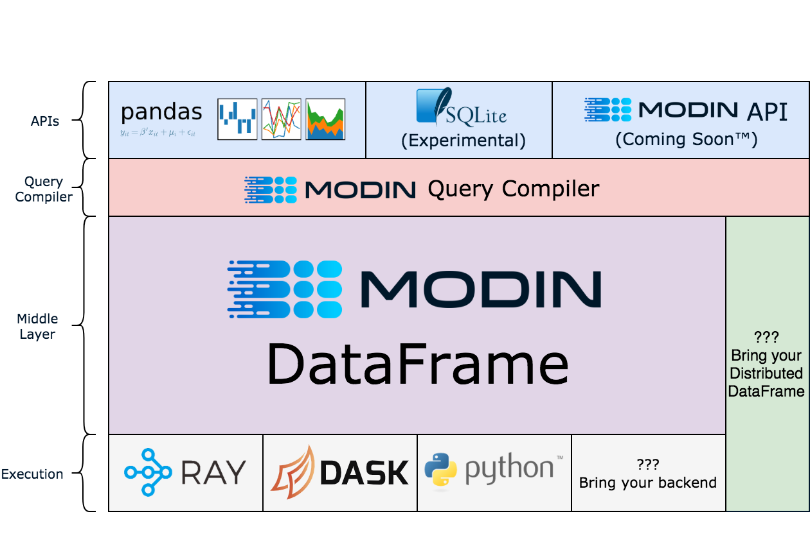

<!---theme:white-->

```{r setup, include=F}
library(fontawesome)
```

<style>
div.lightsalmon pre { background-color:lightpink; }
</style>

<style>
p.caption {
  font-size: 0.25em;
  text-align: left;
}
</style>

<style type="text/css">
  .reveal p {
    text-align: left;
  }
  .reveal ul {
    display: block;
  }
  .reveal ol {
    display: block;
  }  
</style>

## motivation

<center>{#id .class width=50% height=50%}</center>

```python
import pandas as pd
pd.read_csv("some_large_csv_file.csv")
pd.read_csv("some_csv_file_with_loads_of_strings.csv")
```
<div class = "lightsalmon">
```
Error Message
```
</div>

<aside class="notes">

- Start my journey, DS, ML 10 years ago, excited, learnt about pandas, built some modes with scikit learn

- project with some text data, got everythign together and loaded it into pandas and bang pandas stopped working, I didn't really know that pandas is not very good at handling strings or text data. 

- then at different times I did some silly things like making a sparse matrix dense until learnt about sparse matrices. 

- then came along some "big data tools" spark/scala

- there is a steep learning curve, tyring to spin up clusters, I alwayws end up messing something up - I have to debug something, end up writing some guide how to access something etc. really I only want to look at the data. 

- never really been sufficent for me, I always end up sampling data and going back to pandas and then sometimes a rewrite to get it to work in spark.datagframe etc. 

- more recently there have been a few tools that are taking advantages of changin landscape. 

</aside>

## what you will learn here 

- parquet & arrow
- pandas 
  - modin (on ray)
- pydatatable
- vaex
- live(ish) demo

<em>who am I</em> 

- Brian Carter, Director of ML @ [Optum](https://optum.com)
- `r fa("envelope", fill="steelblue")` brianthomascarter@gmail.com
- `r fa("twitter", fill="steelblue")` ibriancarter
- `r fa("github", fill="steelblue")` ibriancarter

<aside class = "notes"> 
- really focused from a consumer point of view, not a developer on any of these tools. 
- my day to day job is analysing data, half the time I am talking to people trying to get that data and then tyring to understand it. 
- could carry on, but I often don't want the mental burden of switiching between tooling. 
- often times moving from single machine technologies to big compute tech with clusters can be difficult. 
</aside>

## what is great about pandas

<center>
{#id .class width=80% height=70% }
</center>

- API, interactivity, fast
- 280 

<aside class = "notes">

- interactivity - the idea of Literate programming from Donald Knuth, which aim is to enable programmers to develop programs in the order demanded by logic and flow of their thoughts. 
- data debugging .
- NB.1 Show how long it takes to load 

</aside>

<p class="caption"> Source: <a href="https://towardsdatascience.com/get-faster-pandas-with-modin-even-on-your-laptops-b527a2eeda74">Get faster pandas with Modin, even on your laptops.</a></p>


## standardisation
<center>
{#id .class width=50% height=50% } {#id .class width=50% height=50% }
</center>

<p class="caption"> Source: <a href="https://arrow.apache.org/">Apache Arrow.</a></p>

<aside class = "notes">
 

he Hadoop ecosystem has standardized on columnar formats—Apache Parquet for on-disk storage and Apache Arrow for in-memory. With this trend, deep integration with columnar formats is a key differentiator for big data technologies. Vertical integration from storage to execution greatly improves the latency of accessing data by pushing projections and filters to the storage layer, reducing time spent in IO reading from disk, as well as CPU time spent decompressing and decoding. Standards like Arrow and Parquet make this integration even more valuable as data can now cross system boundaries without incurring costly translation. Cross-system programming using languages such as Spark, Python, or SQL can becomes as fast as native internal performance.

In this talk we’ll explain how Parquet is improving at the storage level, with metadata and statistics that will facilitate more optimizations in query engines in the future. We’ll detail how the new vectorized reader from Parquet to Arrow enables much faster reads by removing abstractions as well as several future improvements. We will also discuss how standard Arrow-based APIs pave the way to breaking the silos of big data. One example is Arrow-based universal function libraries that can be written in any language (Java, Scala, C++, Python, R, ...) and will be usable in any big data system (Spark, Impala, Presto, Drill). Another is a standard data access API with projection and predicate push downs, which will greatly simplify data access optimizations across the board.

</aside> 


## Apache Arrow & Parquet

<center>

</center>

- parquet: On disk columar storage
- arrow: in memory columar format 

<aside class = "notes">

- flest this out. 

</aside>


<p class="caption"> Source: <a href="https://www.slideshare.net/Hadoop_Summit/hadoop-performance-optimization-at-scale-lessons-learned-at-twitter/62-IN_SUMMARYKey_takeawaysProle">Hadoop Performance Optimization at Scale, Lessons Learned at Twitter </a></p>

## data.table

<center>
{#id .class width=50% height=50%}
</center>


- started in 2006 by Matt Dowle (currently at [h2O](h20.ai))
- focus on time series originally, can be used in genomics 
- h20 ported this to python [datatable](https://github.com/h2oai/datatable)
- 100GB on a single node machine 


<aside class = "notes">

- first foray into something different was data.table when it was created for R.
- explain what data.table is 
- data.table is now available for python 
- I do like it 
- but I had to learn a whole new API 
- R package originally 
- syntax like matrix, rows in i, columns j, expression on columns can be done by groups. 
- short syntax 
- SQL Tables have no inherent order. If you want some form of ordering that you can rely upon, it's up to you to provide enough deterministic expression(s) to any ORDER BY clause such that each row is uniquely identified and ordered.
-

- Column-oriented data storage.

- Native-C implementation for all datatypes, including strings. Packages such as pandas and numpy already do that for numeric columns, but not for strings.

- Support for date-time and categorical types. Object type is also supported, but promotion into object discouraged.

- All types should support null values, with as little overhead as possible.

- Data should be stored on disk in the same format as in memory. This will allow us to memory-map data on disk and work on out-of-memory datasets transparently.

</aside>

## modin

```
import modin.pandas as pd
```
<center>
{#id .class width=75% height=60%}
</center>

<aside class = "notes">

- expalin what, where, ray
- ray does not work on windows
- you often have to know how to partition data, setting it up is a pain. 
- I don't really want to know anything about how distributed computing works. 
- batching 

</aside>


<p class="caption"> Source: <a href="https://github.com/modin-project/modin">modin-project/modin </a></p>

## modin on ray 


## vaex

<center>{#id .class width=40% height=40%}</center>

- out of core data frames
- data + state
- 1 billion rows/second 
- 10-1000x improvement string processing wrt to pandas

<p class="caption"> Source: <a href="https://towardsdatascience.com/vaex-out-of-core-dataframes-for-python-and-fast-visualization-12c102db044a">Vaex: OUt of Core Dataframes for Python and Fast Visualisation</a></p>

<aside class = "notes">


- vaex was a visulation library now a dataframe library.
- laxy expressions / no memory copies
- columar storage with hdf5 & arrow support
- very memory efficent uses memory mapping
- data+state just in time compile. 
- has nice vizualisation support, plus some stuff for remote data frames and some ml tooling.
- kmeans pca & xgboost with lightgbm library integrated. 
- what is out of memory ? 

</aside>


## Vaex: data + state
<sub>

```python
# pandas creates a temporary dataframe, with all the columns 
# and sums on d
df[df.c < 0].d.sum()
```

```python
# Vaex Expressions
df2 = df[df.c<0]

#vaex state 
df2 = {
  'data': df,
  'state': {
    'filter': 'c < 0'}
    }
```

<aside class = "notes">
- filter , no copy made, reference the same data and remember the filter
- this state can then be saved and re-used, say for scoring data 
</aside>

## Vaex: data + state

```python 
# Vaex Virtual Column
df2['z'] = df.x + df.y + 10

df2 = {
  'data': df,
  'state': {
  'filter: 'y < 10',
  'virtual_columns' : {
    'z' " 'x = y*10'
  }
  }
}
```

<aside class = "notes">
- similar if you add a column it creates a virtual column in the state. 
</aside>


## work to do 

- more libraries 
  - SFrame
  - Dask 
  - Spark
  - cudaDF from Rapids
  - xframe C++ library

- evaluation set

- refine benchmarking


<aside class = "notes">
- comprehensive dataset to evaluatate
- is the mental overload, its hard moving between tooling - unless it really good
</aside>  
## evaulation criteria

```{r, echo = F, warning = F}
library(readxl)
file <- "frames_comparison.xlsx"
frame_use <- read_excel(file, sheet = 1)
#frame_bench <- read.xlsx(file, sheet =2 )

library(knitr)
library(kableExtra)
options(knitr.kable.NA = '')
x_html <-kable(frame_use, format = "html")
kable_styling(x_html,  "striped", full_width = FALSE, font_size = 16)

```


<aside class = "notes">

Talking Points

- pandas: very flexible but loves making memory copies
- dask has the same issue, but distributes the memory copies 
- modin seems to have a better solution
- datatable and vaex are very memory efficent 
- xframe c++ dataframe library ?
- arrow standarisation - can talk across 
- Single API, different engines. 

<aside>