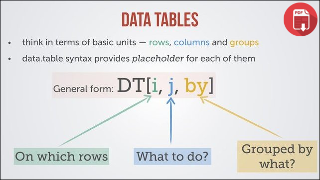

## Change this 

```{r setup, include = F}
library(reticulate)
use_python("/Users/bcarte18/anaconda3/envs/po_pandas/bin/python")
```

<style>
div.lightsalmon pre { background-color:lightpink; }
</style>

## Introduction


<aside class="notes"> How Data Science works: My background is 

too large Data
want to interact with data - Literate Programming Paradaigm

meagbyte scale data as we do for terrabyte data landscape. 
Bring something in here about distributed data. 

- something about genomics 

</aside>

## Current Data Science Landscape (change name) 

These tools are very well establish. Need to see this picture. 


<aside class="notes">Test notes </aside>


## pandas 

{#id .class width=50% height=50%}

```
import pandas as pd
pd.read_read("some_large_csv_file.csv")
```
<div class = "lightsalmon">
```
Error Message
```
</div>


<aside class="notes">

- Start my journey, DS, ML 10 years ago, excited, learnt about pandas, built some modes with scikit learn - 
- One day I started to do a project with some text data, got everythign together and loaded it into pandas
- Of course I used I did silly things, taking a sparse matrix and making it dense. 
- Bigger & better table

</aside>

## what you will learn here 

## Apache Arrow & Parquet

Image required 

he Hadoop ecosystem has standardized on columnar formats—Apache Parquet for on-disk storage and Apache Arrow for in-memory. With this trend, deep integration with columnar formats is a key differentiator for big data technologies. Vertical integration from storage to execution greatly improves the latency of accessing data by pushing projections and filters to the storage layer, reducing time spent in IO reading from disk, as well as CPU time spent decompressing and decoding. Standards like Arrow and Parquet make this integration even more valuable as data can now cross system boundaries without incurring costly translation. Cross-system programming using languages such as Spark, Python, or SQL can becomes as fast as native internal performance.

In this talk we’ll explain how Parquet is improving at the storage level, with metadata and statistics that will facilitate more optimizations in query engines in the future. We’ll detail how the new vectorized reader from Parquet to Arrow enables much faster reads by removing abstractions as well as several future improvements. We will also discuss how standard Arrow-based APIs pave the way to breaking the silos of big data. One example is Arrow-based universal function libraries that can be written in any language (Java, Scala, C++, Python, R, ...) and will be usable in any big data system (Spark, Impala, Presto, Drill). Another is a standard data access API with projection and predicate push downs, which will greatly simplify data access optimizations across the board.


## data.table

{#id .class width=50% height=50%}

- started in 2006 by Matt Dowle (currently at [h2O](h20.ai))
- focus on time series originally, can be used in genomics 
- h20 ported this to python [datatable](https://github.com/h2oai/datatable)
- 100GB on a single node machine 


<aside class = "notes">

- first foray into something different was data.table when it was created for R.
- explain what data.table is 
- data.table is now available for python 
- I do like it 
- but I had to learn a whole new API 
- R package originally 
- syntax like matrix, rows in i, columns j, expression on columns can be done by groups. 
- short syntax 
- SQL Tables have no inherent order. If you want some form of ordering that you can rely upon, it's up to you to provide enough deterministic expression(s) to any ORDER BY clause such that each row is uniquely identified and ordered.
-

- Column-oriented data storage.

- Native-C implementation for all datatypes, including strings. Packages such as pandas and numpy already do that for numeric columns, but not for strings.

- Support for date-time and categorical types. Object type is also supported, but promotion into object discouraged.

- All types should support null values, with as little overhead as possible.

- Data should be stored on disk in the same format as in memory. This will allow us to memory-map data on disk and work on out-of-memory datasets transparently.

</aside>


## dask

- comes out of continium - these are the main guys behind conda

- dask has a low task scheduler which executes python functions on a cluster. 

- address some of these points https://docs.dask.org/en/latest/best-practices.html


## modin

- expalin what, where, ray
- ray does not work on windows

## vaex (v)
 
 - hdf, arrow
 - ml (sklearn, annoy, xgboost/lightgbm, catboost) + automatic pipelines
 - effiecting with memory, due to expression system
 - column based storage + memory mapping 
 - don't need a cluster to run vaex
 - 10-1000x string processing wrt to Process 


<aside = "notes">
- pronounced like VAT
- Out of Core Dataframes for Python 
- Maarten Breddel vaex.io
- Has some inbuilt 

Pandas is the mother of all, then you have dask.dataframe, Modin, SFrame, 
cudf, voex,

- virtual columns with expressions do something nice 

</aside>

## Whats to do 

- Lots
- SFrame, Spark, cudaDF(Rapids)
</aside>

## BenchMark Table 


